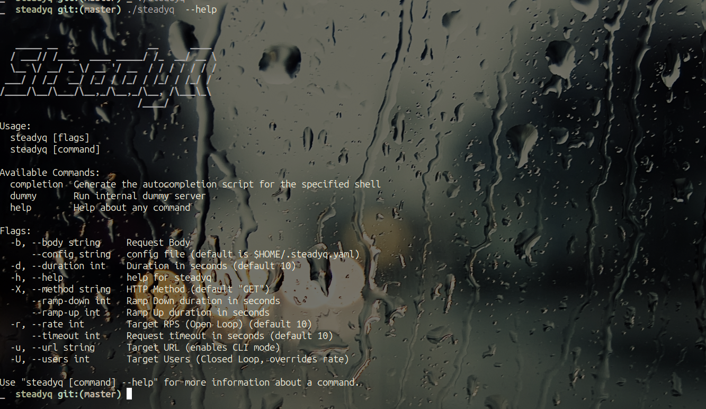

# SteadyQ 🚀



SteadyQ is a modern, TUI-based load testing tool designed for developers who need a quick, visual, and interactive way to stress test HTTP endpoints and custom shell commands.

## 🌟 Features

- **Interactive TUI**: Built with Bubble Tea for a terminal-based UI experience.
- **Dual Request Types**:
  - **HTTP**: Standard GET/POST requests with custom headers and body support.
  - **Script**: Execute any shell command with template variables (`{{userID}}`, `{{chatID}}`).
- **Flexible Load Modes**:
  - **RPS (Open Loop)**: Target a specific Requests Per Second with linear ramp-up/down.
  - **Users (Closed Loop)**: Simulate fixed concurrent users with think time between requests.
- **Real-time Dashboard**: Visualize latency, throughput, errors, and response codes live.
- **CLI Mode**: Headless execution for CI/CD pipelines and automation.
- **Export Capabilities**: Export results to CSV and JSON formats.

## 📦 Installation

Prerequisites: `Go 1.21+`

```bash
# Clone the repository
git clone https://github.com/yourusername/steadyq.git
cd steadyq

# Build the binary
go build -o steadyq .

# Move to path (Optional)
sudo mv steadyq /usr/local/bin/
```

## 🎮 Usage

### TUI Mode (Interactive)

Run the tool with the interactive terminal interface:

```bash
steadyq
```

### CLI Mode (Headless)

Execute load tests from command line for automation:

```bash
# Basic HTTP test
steadyq --url http://localhost:8080/api --method GET --rate 100 --duration 30

# Users mode with think time
steadyq --url http://localhost:8080/api --users 50 --duration 60 --think-time 100

# Custom shell command
steadyq --command "curl -X POST http://api.com/chat -d 'user={{userID}}'" --rate 50 --duration 20
```

### Key Bindings

| Key                 | Action                                |
| :------------------ | :------------------------------------ |
| `Ctrl+Left/Right`   | Switch Views (Runner, Dashboard)      |
| `Tab` / `Shift+Tab` | Navigate Fields                       |
| `Enter`             | Edit Field                            |
| `Space`             | Toggle Modes (RPS/Users, HTTP/Script) |
| `Ctrl+R`            | **Run** Test                          |
| `Ctrl+S`            | **Stop** Test                         |
| `Ctrl+D`            | Go to Dashboard                       |
| `Ctrl+P`            | Export Results                        |
| `Ctrl+Q`            | Quit                                  |

## 🏃‍♂️ Runner View


The Runner view provides an interactive interface for configuring and executing load tests. Configure:

- **Request Type**: HTTP requests or custom shell scripts
- **Load Mode**: RPS (open loop) or Users (closed loop)
- **Target Configuration**: Rate, users, duration, ramp-up/down times
- **Advanced Options**: Think time, timeouts, custom commands

## 📊 Dashboard View


The Dashboard view offers comprehensive real-time monitoring with:

- **Live Metrics**: Requests, RPS, inflight requests, target configuration
- **Latency Analysis**: P50, P90, P95, P99 percentiles, mean, and max latency
- **Response Breakdown**: Status code distribution with visual bars
- **Error Analysis**: Detailed error categorization and counts
- **Progress Tracking**: Visual progress bar showing ramp-up, steady state, and ramp-down phases

## 🛠 Configuration

### Request Types

- **HTTP**: Standard GET/POST requests with URL, method, and body configuration.
- **Script**: Execute any shell command. Use `{{userID}}` and `{{chatID}}` as placeholders for unique identifiers.

### Load Modes

- **RPS (Open Loop)**: "Open Loop" testing. Tries to maintain target throughput regardless of response time.
- **Users (Closed Loop)**: "Closed Loop" testing. Simulates fixed concurrent users with think time between requests.

### CLI Flags

| Flag           | Short | Description                          | Default |
| :------------- | :---- | :----------------------------------- | :------ |
| `--url`        | `-u`  | Target URL                           | -       |
| `--method`     | `-X`  | HTTP Method                          | GET     |
| `--body`       | `-b`  | Request Body                         | -       |
| `--rate`       | `-r`  | Target RPS (Open Loop)               | 10      |
| `--users`      | `-U`  | Target Users (Closed Loop)           | 0       |
| `--duration`   | `-d`  | Duration in seconds                  | 10      |
| `--ramp-up`    | -     | Ramp Up duration in seconds          | 0       |
| `--ramp-down`  | -     | Ramp Down duration in seconds        | 0       |
| `--timeout`    | -     | Request timeout in seconds           | 10      |
| `--think-time` | -     | Think time in milliseconds (Users mode) | 0    |

### Examples

```bash
# HTTP GET with ramp-up
steadyq --url http://localhost:8080/health --rate 100 --duration 60 --ramp-up 10

# POST request with body
steadyq --url http://localhost:8080/api --method POST --body '{"query":"test"}' --rate 50

# Users mode with think time
steadyq --url http://localhost:8080/api --users 20 --duration 30 --think-time 500

# Custom shell command
steadyq --command "curl -X POST http://api.com/chat -d 'user={{userID}}&chat={{chatID}}'" --rate 25
```

## 📊 Metrics

### Performance Metrics

- **Throughput**: Requests per second with real-time updates
- **Latency**: P50, P90, P95, P99 percentiles, mean, and max response times
- **Error Rate**: Failed requests count and percentage
- **Response Codes**: Distribution of HTTP status codes
- **Queue Wait**: Time requests spend waiting to be processed

### Export Formats

Export test results for further analysis:

```bash
# Results are automatically exported when using Ctrl+P in dashboard
# Files generated: steadyq_report_{timestamp}.{csv,json}
```

## 🎨 Interface Features

- **Theme Support**: Clean, color-coded terminal interface
- **Real-time Updates**: 100ms update intervals for live metrics
- **Progress Visualization**: Visual progress bar showing test phases
- **Error Highlighting**: Color-coded error and warning indicators
- **Status Indicators**: Clear phase indicators (Ramp Up, Steady State, Ramp Down)

## 🚀 Advanced Usage

### Custom Shell Commands

Execute complex load testing scenarios with shell commands:

```bash
# Test with authentication
steadyq --command "curl -H 'Authorization: Bearer token' http://api.com/protected" --rate 100

# Database load test
steadyq --command "psql -c 'SELECT * FROM users WHERE id={{userID}}'" --users 50
```

### Ramp Profiles

Configure sophisticated load patterns:

```bash
# Gradual ramp-up and ramp-down
steadyq --url http://localhost:8080/api --rate 200 --duration 120 --ramp-up 30 --ramp-down 30

# Instant load with gradual shutdown
steadyq --url http://localhost:8080/api --rate 100 --duration 60 --ramp-down 20
```

## 📝 License

MIT
